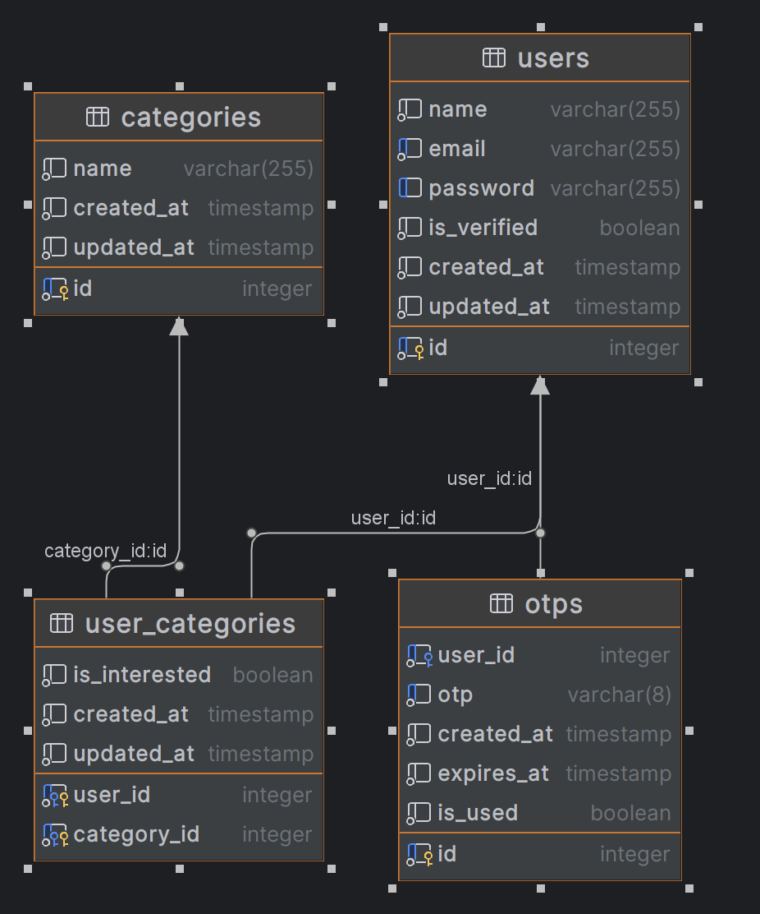
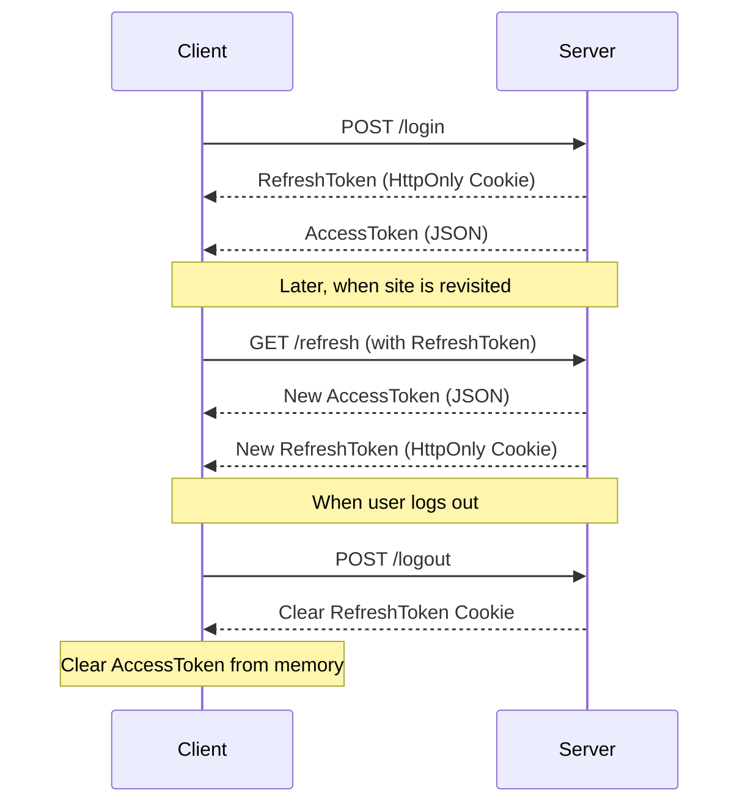

# Fullstack-Test-2024-07-13

[A simple e-commerce website](#a-simple-e-commerce-website)
[Conways Game of Life](#conways-game-of-life)

## A simple e-commerce website

Find the client in the [app/client](./app/client) directory and the server in the [app/server](./app/server) directory

The client is deployed on [https://rocs8assignment.vercel.app/](https://rocs8assignment.vercel.app/)

### Tech Stack

#### Client

- Next.js
- TypeScript
- Tailwind
- shadcn ui components
- react hook form
- RTK Query for data fetching

#### Server

- Node.js
- Express
- TypeScript
- Drizzle ORM
- PostgreSQL
- Mailgun for sending emails

### Approach

#### Client api calls

1. The client uses RTK Query for fetching the data from the server,all the api calls happens on the client side because it's robust, explicit
2. In the [app/client/src/store/index.ts](./app/client/src/store/index.ts#L34), intercepting the requests and if a 403 status code is received, it sends an refresh token request and then retries the original request
3. In the [app/client/src/store/api/categoryApi.ts](./app/client/src/store/api/categoryApi.ts#L50-L81), using optimistic updates for updateCategory for better user experience
4. Using cache invalidation for the updateCategory

#### Database Schema



1. There are 4 tables in the database: `users`, `categories`, `user_categories`, and `otps`
2. The `users` table stores the user's information like name, email, password, and if the user is verified or not
3. The `categories` table stores the categories of the products
4. The `user_categories` table stores the user's interest in the categories
5. The `otps` table stores the OTPs for the user for email verification

#### Token Strategy



1. The client sends a POST request to `/login` with the user's credentials
2. The server validates the credentials and sends back a `RefreshToken` as an HttpOnly cookie and an `AccessToken` as a JSON response
3. The client stores the `AccessToken` in memory and the `RefreshToken` in a cookie
4. When the user revisits the site, the client sends a GET request to `/refresh` with the `RefreshToken`
5. The server validates the `RefreshToken` and sends back a new `AccessToken` and a new `RefreshToken
6. When the user logs out, the client sends a POST request to `/logout` and the server clears the `RefreshToken` cookie and the client clears `AccessToken` from memory

Reason to pick this strategy: This strategy uses JWT tokens which are stateless and unlike sessions doesn't need to be stored in the db or redis cache. The `AccessToken` is stored in the memory and that's why it's more secure unlike places where it's stored in the local storage or session storage. The `RefreshToken` is stored in the HttpOnly cookie which makes it more secure and can't be accessed by the client side JavaScript.

For more security we can implement the `RefreshToken` rotation where we store the `RefreshToken` in the db and when the user logs out or the `RefreshToken` is used, we delete the `RefreshToken` from the db. This way we can keep track of the `RefreshToken` and if it's compromised, we can revoke it. But to keep things simple, I didn't implement this.

#### App's working

1. The user signs up with their name, email and password. The user is sent an email with an OTP to verify their email.
2. The user verifies their email by entering the OTP.
3. The user sees the categories of the products and selects the categories they are interested in.

### How to run the app

#### Prequisites

1. Node.js (v20+) [Reference](https://nodejs.org/en)
2. pnpm (v9+) [Reference](https://pnpm.io/installation)
3. Docker [Reference](https://docs.docker.com/get-docker/)

#### Steps

1. Clone the repository
2. Spin the postgres container by using the following command

```bash
docker compose  -f "compose.yaml" up -d --build postgres
```

3. Now make an `.env` file in the app/server directory and add the variables given in the `.env.example` file, you can customize the variables as per your need and use your own smtp and database credentials

4. First seed the database by running the following command in the [app/server](./app/server/) directory in the terminal
```bash
node seed_categories.js
```

5. Create an `.env.local` file in the [app/client](./app/client/) directory and add the variables given in the `.env.example` file, you can customize the variables as per your need

6. Now spin the server and client containers by using the following command in the root directory

```bash
docker compose  -f "compose.yaml" up -d --build client server
```

7. The client is now on [http://localhost:3000](http://localhost:3000) and the server is on [http://localhost:3434](http://localhost:3434)

8. The server won't run without SMTP credentials, so make sure to add the SMTP credentials in the `.env` file and compose file

9. If you want to run the server without SMTP, do these changes
   a. Go to the [app/server/src/env/ts](./app/server/src/env.ts#L15-L18) and comment out the SMTP variables
   b. Go to the [app/server/src/controllers/auth.controller.ts](./app/server/src/controllers/auth.controller.ts#L58). Uncomment the `isVerified: true` and comment out lines [66-72](./app/server/src/controllers/auth.controller.ts#L66-L72).
   c. This will make the user verified without sending the OTP

10. The containers only run only on production mode. To run the containers in development mode, Run the following command in the root directory

   a. Take down the client and server containers, not the database
   ```bash
   docker compose -f "compose.yaml" down client server
   ```

   b. Run 
   ```bash
   pnpm dev
   ```

   c. This would simultaneously run the client and server in development mode

   d. Both the client and server are now on [http://localhost:3000](http://localhost:3000) and [http://localhost:3434](http://localhost:3434) respectively

## Conway's Game of Life

The client is deployed on [https://verdant-lamington-a58026.netlify.app/](https://verdant-lamington-a58026.netlify.app/)

Find it in the [app/conway](./app/conway) directory

### Tech Stack

- React
- TypeScript
- Vite
- TailwindCSS
- shadcn ui components

### Prequisites to run the app

- Node.js (v20+) [Reference](https://nodejs.org/en)
- pnpm (v9+) [Reference](https://pnpm.io/installation)

### How to run the app

1. Clone the repository
2. To run the app, run the following commands in the terminal

```bash
pnpm install
```

```bash
pnpm cway build && pnpm cway preview
```

OR

```bash
pnpm cway dev
```

3. Open the browser and navigate to `http://localhost:4173` or if you are using the `dev` command, navigate to `http://localhost:5173`
4. The app's also deployed on [https://verdant-lamington-a58026.netlify.app/](https://verdant-lamington-a58026.netlify.app/)

### Features

- Start/Stop the game
- Randomize the grid by clicking the `Reset` button
- Changing the size of cells by sliding the slider
- To view the number of iterations
- To toggle cells by clicking on the cell if the game is in stopped state
- Chaning the size of cell resets the grid and iterations
- The cells are not fixed number, they are dynamic and are changed based on the size of screen (maximum size of grid: 1500px x 1500px, doesn't go beyond that)
